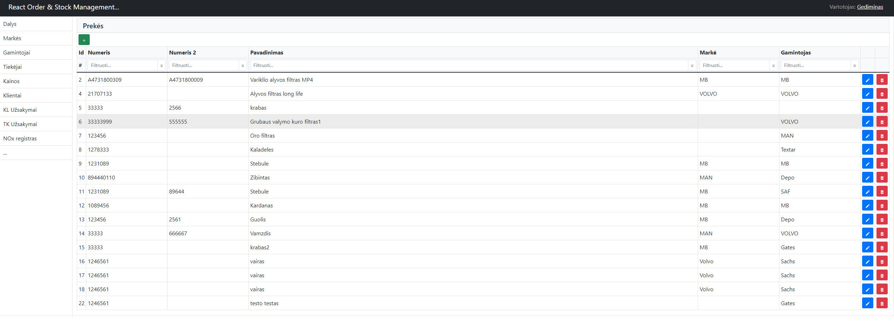
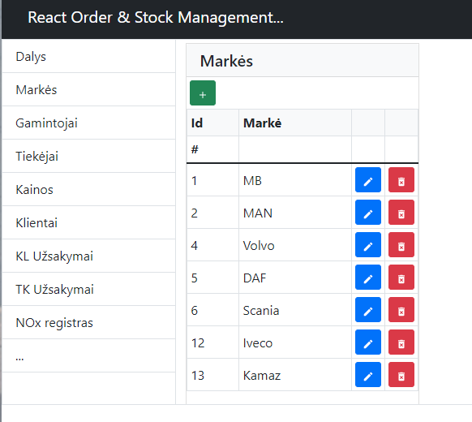

# React Stock Inventory Management

Warehouse stock management. Orders from suppliers. Calculation of warehouse incomes according to set parameters. Build with React Js, Node Js and MySql server.

## Screenshots

## Authors

- [@GedasBu](https://github.com/GedasBu)

